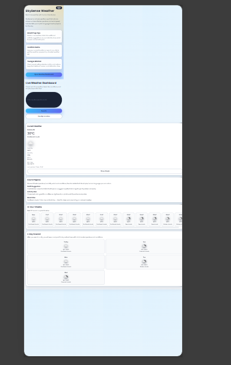

# Weather Dashboard

A lightweight weather dashboard built with vanilla HTML, CSS, and JavaScript.

## Project Snapshots

### Home / Dashboard Preview

The home dashboard is built with a modern hero section, weather cards, timeline blocks, and forecast panels to keep key weather information easy to scan.

### Mobile Responsive View

The layout adapts for phone screens with compact spacing, full-width controls, and stack-based cards so users can search and read weather insights comfortably on smaller devices.

## Features

- Search weather by city name with geocoding support.
- Fetch current weather and short-term forecast.
- Show practical weather-based suggestions.
- View charts and AQI data on a dedicated graph page.
- Toggle between light and dark theme.

## Tech Stack

- HTML5
- CSS3
- JavaScript (ES6+)
- OpenWeatherMap APIs
- Chart.js (CDN)

## Project Structure

- `index.html` - Main dashboard page
- `script.js` - Main weather logic and UI rendering
- `style.css` - Dashboard styling
- `graph.html` - Graph and AQI page
- `graph.js` - Chart and AQI logic
- `graph.css` - Graph page styling

## Run Locally

Open `index.html` in a browser, or serve the project with any static file server.

## Notes

This project uses client-side API calls. For production usage, move API keys to a secure backend.

